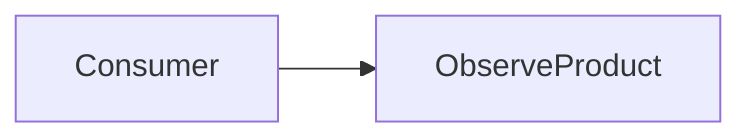
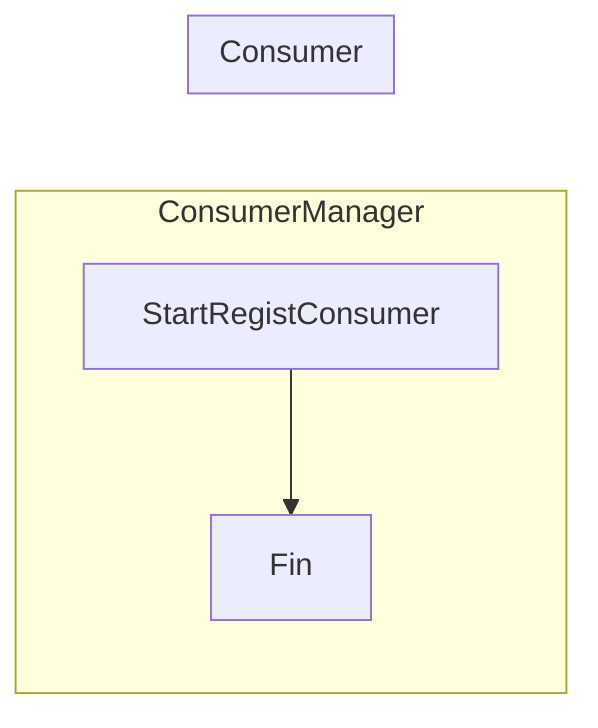
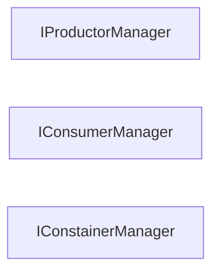

# 容器注册
容器注册

## 相关对象
> Consumer : 消费者  
> Productor : 生产者  
> Container : 容器  
> Manager

## 注册/获取容器  

```mermaid
flowchart LR
    Consumer --> ObserveProduct
```

```mermaid
flowchart LR
    subgraph ConsumerManager
    StartRegistConsumer --> Fin
    end

    subgraph Consumer
    end
```

```mermaid
flowchart LR
    IProductorManager
    IConsumerManager
    IConstainerManager
```

Pipe:
    produce pipe  
    distribute pipe
    consume pipe

