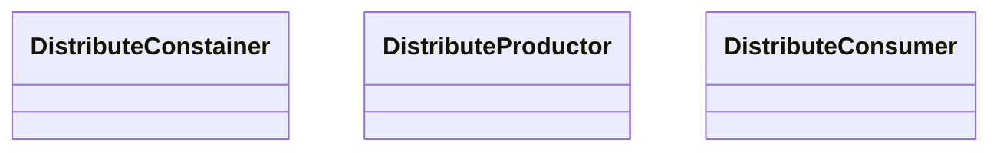
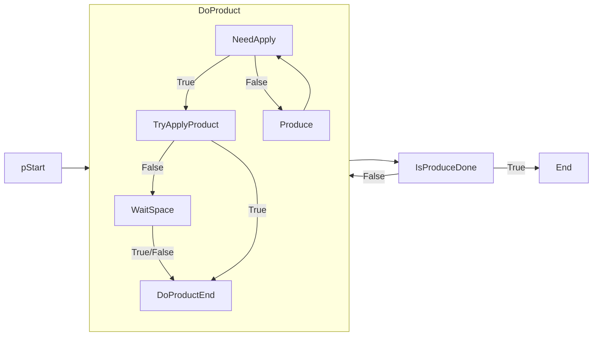
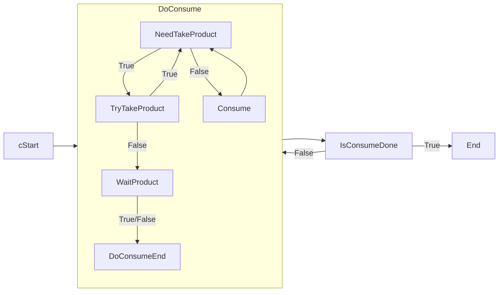

# 数据分发
数据分发模块

## 主要成员

```mermaid
classDiagram    
    class DistributeConstainer
    class DistributeProductor
    class DistributeConsumer


```

## 生产

```mermaid
flowchart LR
    pStart --> DoProduct
    WaitSpace --> |True/False| DoProductEnd
    IsProduceDone --> |False| DoProduct
    IsProduceDone --> |True| End

    subgraph DoProduct
    NeedApply
    NeedApply --> |True| TryApplyProduct 
    NeedApply --> |False| Produce
    Produce --> NeedApply
    TryApplyProduct --> |True| DoProductEnd 
    TryApplyProduct --> |False| WaitSpace

    DoProductEnd
    end

    DoProduct --> IsProduceDone
```

## 消费

```mermaid
flowchart LR
  cStart --> DoConsume
  IsConsumeDone --> |True| End
  IsConsumeDone --> |False| DoConsume

  subgraph DoConsume
    NeedTakeProduct --> |True| TryTakeProduct --> |False| WaitProduct --> |True/False| DoConsumeEnd
    TryTakeProduct --> |True| NeedTakeProduct
    NeedTakeProduct --> |False| Consume --> NeedTakeProduct
    
  end

  DoConsume --> IsConsumeDone
```

