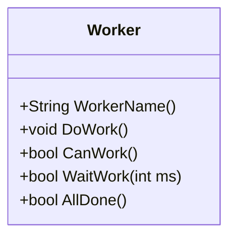
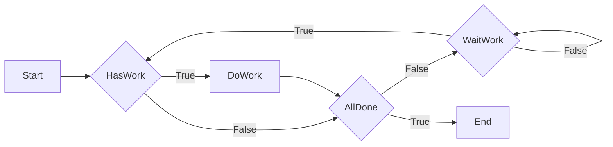
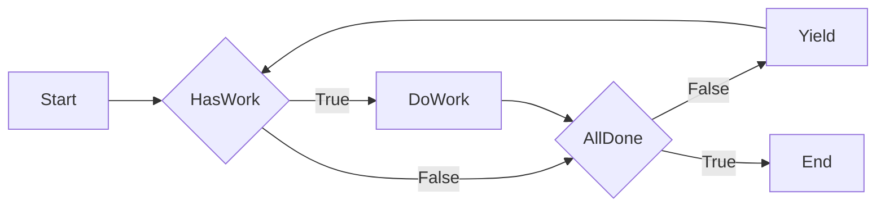

# Worker 调度

## Worker 类基本成员

```mermaid
classDiagram
class Worker
Worker : +String WorkerName()
Worker : +void DoWork()
Worker : +bool CanWork()
Worker : +bool WaitWork(int ms)
Worker : +bool AllDone()
```  

## 调度方式
调度分为独立调度和非独立调度,其中独立调度为单独线程完成任务,非独立调度则由调度线程和工作线程协作完成任务.
### 独立调度

```mermaid
flowchart LR    
    Start --> HasWork{HasWork}
    HasWork --True--> DoWork
    HasWork --False--> AllDone{AllDone}
    DoWork--> AllDone
    AllDone --> |False| WaitWork{WaitWork}
    WaitWork --> |False| WaitWork
    WaitWork --> |True| HasWork
    AllDone --> |True| End
```

### 非独立调度

```mermaid
flowchart LR
    Start --> HasWork{HasWork}
    HasWork --True--> DoWork
    HasWork --False--> AllDone{AllDone}
    DoWork--> AllDone
    AllDone --> |False| Yield
    Yield --> HasWork
    AllDone --> |True| End
```